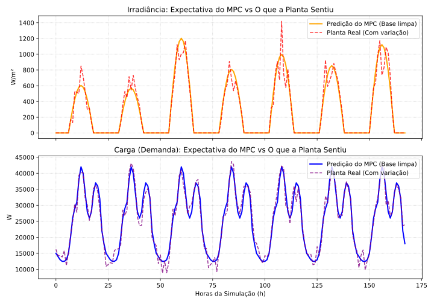
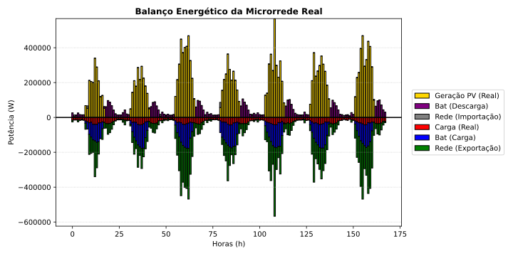
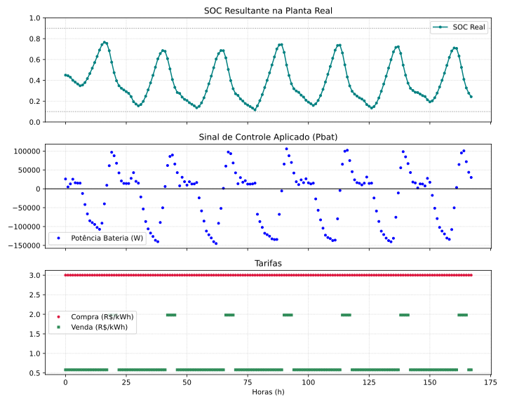
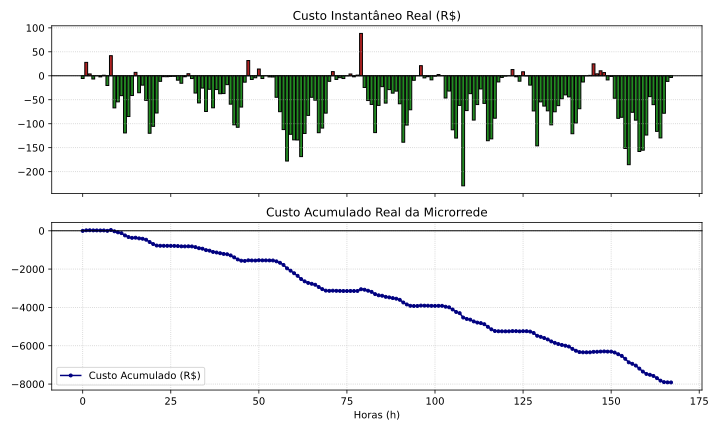

# Microrrede PV + ESS com MPC Econômico

Este repositório contém o modelo de simulação e controle preditivo baseado em modelo (MPC) para uma microrrede com geração fotovoltaica e sistema de armazenamento de energia (ESS).

## Arquivos do Projeto

* `modelo_microrrede_pv_ess.py`: Modelagem da microrrede (PV + Bateria).
* `mpc_economico_microrrede.py`: Algoritmo de controle MPC econômico.
* `teste_mpc_economico_microrrede.py`: Script de teste e execução das simulações.

---

## Resultados

### Modelo da Planta

### Balanço Energético

### Estado de Carga (SOC), Potência da Bateria e Tarifas

### Custos

