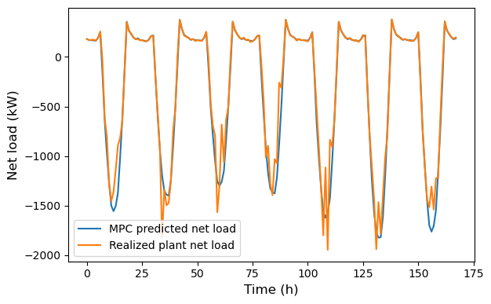
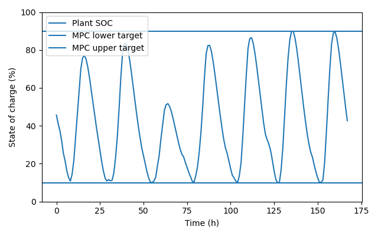
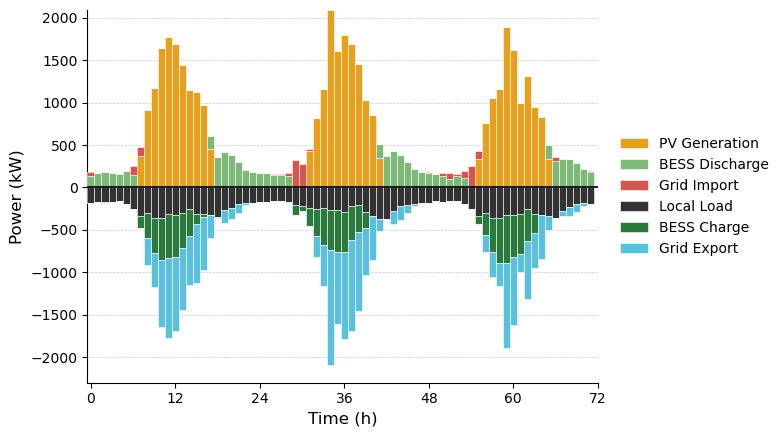
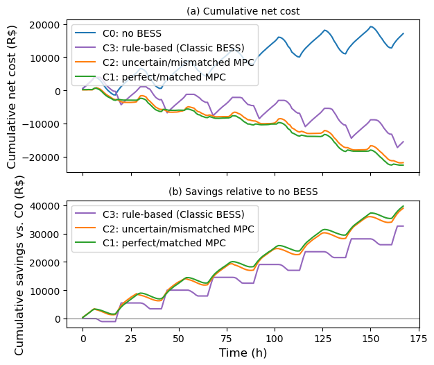

# Incremental Economic MPC – Microrrede PV-BESS

Simulação em malha fechada de 7 dias (168 h, passo de 1 h, seed 42) de uma microrrede conectada à rede com PV + BESS, com **planta separada do modelo do controlador**.

## Experimentos

- **C0 – No BESS:** bateria desligada (`Pb = 0`). Referência de custo e de troca com a rede.
- **C1 – Perfect/matched MPC:** MPC recebe carga e irradiância reais e usa os mesmos parâmetros da planta. Benchmark ideal.
- **C2 – Uncertain/mismatched MPC:** MPC recebe previsões com erro e usa parâmetros diferentes da planta (PV, capacidade, eficiências). Caso principal.

**Configuração comum**
- Horizonte de predição `Np = 24 h` e de controle `Nu = 12 h`
- Otimização por SLSQP sobre os incrementos de potência da bateria
- Compra: R$ 3,00/kWh
- Venda: R$ 1,98/kWh (18h–21h) e R$ 0,58/kWh nas demais horas
- As três simulações usam a mesma realização estocástica

**Convenção de sinais:** bateria positiva = descarga; rede positiva = importação.

---

## Figuras

### Fig. 2 – Net load previsto x realizado


- **Experimento:** carga − geração PV, usando a previsão do MPC e a realização da planta.
- **Legenda:** *Predicted (azul)*: previsão usada pelo MPC (PV assumido pelo controlador). *Realized (laranja)*: trajetória real da planta. A diferença entre as curvas é o erro de previsão + mismatch de PV.

### Fig. 3 – Estado de carga (C2)


- **Experimento:** SOC medido da planta ao longo dos 7 dias com o controlador incerto.
- **Legenda:** *Plant SOC*: SOC real da bateria. Linhas horizontais em 10 % e 90 %: limites (soft) usados na penalidade do MPC.

### Fig. 4 – Potências nas primeiras 72 h (C2)


- **Experimento:** balanço de potência da planta em 3 dias.
- **Legenda:** *Load*: carga. *PV*: geração fotovoltaica. *Battery*: potência da bateria (+ descarga / − carga). *Grid*: potência da rede (+ importação / − exportação).

### Fig. 5 – Custo acumulado e economia vs. C0


- **Experimento:** comparação econômica entre C0, C1 e C2 na semana.
- **Legenda:**
  - **(a)** custo líquido acumulado (R$). Negativo = receita líquida.
  - **(b)** economia acumulada em relação ao C0 (R$). Positivo = o BESS reduz o custo.
  - C0 (azul), C2 (laranja), C1 (verde).

---

## Executar

```bash
python teste_mpc_economico_microrrede_novo.py
```

Gera os PDFs e PNGs das 4 figuras e imprime as métricas da Tabela II (`E_imp`, `E_exp`, custos, picos, `E_thr`, faixa de SOC).

**Requisitos:** `numpy`, `matplotlib`, módulos `modelo_microrrede_pv_ess` e `mpc_economico_microrrede`, e os dois CSVs de carga (`al4` e `RU`).
